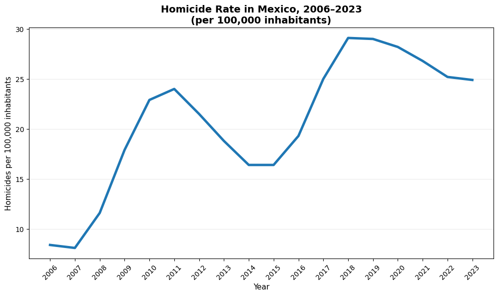
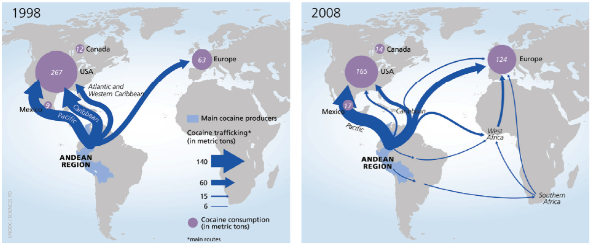
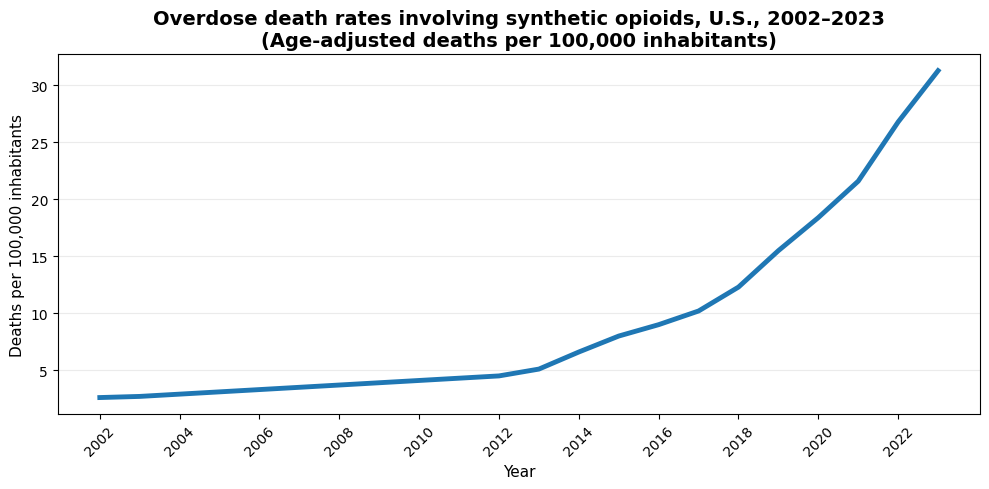
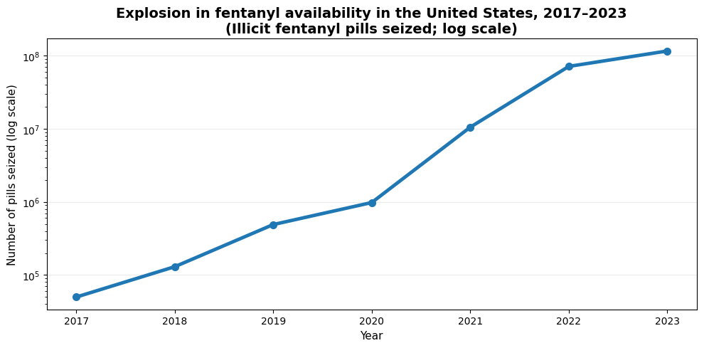
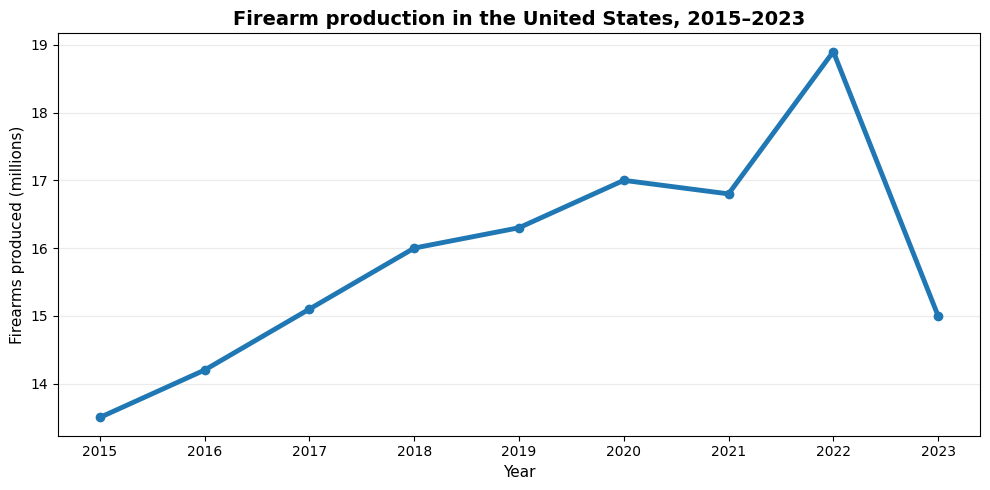
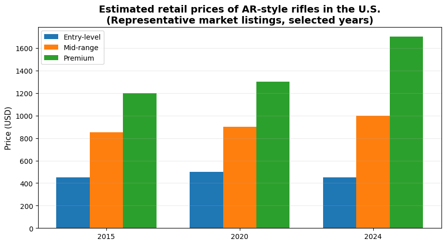

Increasing violence is a phenomenon related with many factors around the world and a clear regional trend in most of the Americas. 

Comparing the cumulative change in the homicide rate per one hundred thousand inhabitants over the last ten years, the index has increased in Mexico by 28%, while in other countries such as USA and Canada, the growth is similar (but at a  different baseline). 

## Homicide trends across the Americas, 2010-2020

| Country                     | Change (%) |
|-----------------------------|------------|
| Chile                       | 82.81      |
| Haiti                       | 64.85      |
| Uruguay                     | 62.41      |
| St. Vincent and the Grenadines | 40.20   |
| Antigua and Barbuda         | 39.34      |
| Grenada                     | 34.28      |
| United States               | 34.27      |
| Barbados                    | 29.23      |
| Mexico                      | 27.93      |
| Canada                      | 23.04      |
| St. Lucia                   | 13.31      |
| Guyana                      | 4.06       |
| Dominica                    | 1.90       |
| Cuba                        | -0.15      |
| Bermuda                     | -1.02      |
| Costa Rica                  | -2.12      |
| Argentina                   | -7.30      |
| Panama                      | -8.13      |
| Jamaica                     | -10.55     |
| Brazil                      | -19.20     |
| Trinidad and Tobago         | -21.02     |
| Bahamas, The                | -27.91     |
| Colombia                    | -34.41     |
| Venezuela, RB               | -35.07     |
| Belize                      | -35.21     |
| Puerto Rico (US)            | -38.78     |
| Nicaragua                   | -41.95     |
| Paraguay                    | -43.60     |
| Honduras                    | -52.10     |
| St. Kitts and Nevis         | -52.40     |
| Ecuador                     | -55.07     |
| Guatemala                   | -55.75     |
| Dominican Republic          | -65.35     |
| El Salvador                 | -67.26     |
| Cayman Islands              | -73.75     |
: Source: UNODC, World Bank

The violence in Latin America is strongly related to drug trafficking markets, but also to inequality and economic crises. Particularly, Mexico faced a severe problem in terms of intentional homicides.

: Source: INEGI, National System of Public Safety of Mexico

If you have seen the HBO Series “The Wire” or “Breaking Bad” you will know what I am talking about. The drug retailers need to domain the territory to control their sales points. 

During the last years, there is a public debate in the Americas to find if the increase of violence has to do with find the true relationship between some independent variables such as economic factors, poverty, institutional framework, cultural values, etc. with the violence as the dependent variable and specifically analyzing the Mexican case. 

Are the drugs the problem? Is it the money? Are the governments? Are the people that consume illegal substances? One of the most significant variables that can explain the violence (and that is not obvious in the model) is transport. 

Let´s see why: in the last 30 years, there have been important structural changes in the drug distribution routes of drug into the US. The closing of Caribbean route in the 1990s meant an increase of the number of drugs coming from Mexico into the USA. Now this brought an increase in violence: a growth in the markup value led to powerful organizations that are fighting fiercely to control the routes. 

According to the United Nations, from 1998 to 2008, channels and routes to introduce drugs into America changed when Mexico became the main route.

## The cocaine case 

Data for the United States, the country with the world’s largest cocaine market, show marked increases in cocaine use in the 1960s and the 1970s, decreases in the 1980s, new increases in the 1990s and declines in the new millennium, notably after 2006.

Traffickers changed their preferred smuggling method in the 1980s and 1990s to shipping the cocaine by boat via the Caribbean. 

Now criminal groups control the trafficking from Mexico into the United States. The shipment methods have changed too: while originally most of the cocaine shipments went directly from Colombia to the United States by air, nowadays this changed again, semi-submarines carrying cocaine started leaving the Pacific coast of Colombia to Mexico; once in  Mexico , the drugs are transported into the United States by terrestrial means in order to reach their final destinations across the country. The US authorities estimate that nearly 90% of the cocaine entering the country crosses the US/Mexico land border. 

: Source: UNODC

## How much cocaine is in the United States?

There is no single official figure for the total amount of cocaine circulating within the United States. However, recent supply-chain models that combine production, trafficking, and consumption estimates suggest that approximately 250–260 metric tons of cocaine are supplied to the U.S. market annually. 

Using the same modeling approaches, Canada is estimated to receive roughly 15–20 metric tons per year, while Mexico is estimated at around 15–25 metric tons, primarily as both a transit country and a secondary consumer market. 

## How much is this worth, and who captures the value?
Historical U.S. government and UN estimates placed the value of the North American cocaine market at around USD 35–40 billion annually in the late 2000s. Given higher global production and sustained demand, the current market value is still in the tens of billions of U.S. dollars per year. The majority of profits are not captured by coca farmers, but by trafficking organizations and distribution networks operating along the supply chain and within the United States. Value accumulation increases sharply at the trafficking and wholesale distribution stages, while farmers capture only a very small fraction of the final retail price.

## And now the opioid crises…
Over the past decade, the opioid crisis in the United States has increasingly been driven by illicitly manufactured fentanyl and other synthetic opioids. Deaths involving synthetic opioids surged dramatically from the early 2010s, growing steadily into the early 2020s as fentanyl replaced heroin and prescription opioids as the primary driver of overdose mortality. 

 
: Source: CDC

In 2023, provisional U.S. mortality statistics show that nearly 73,000 drug overdose deaths involved synthetic opioids, primarily fentanyl—a slight decrease compared with the previous year but still many times higher than pre-fentanyl years. Synthetic opioids accounted for a large majority of opioid-related deaths, with some estimates indicating they were involved in about 70 % of all drug overdose fatalities in that year. 

: Source: CDC, NCHS

## Weapons´ markets: guns can be bought like a toolbox

 In 2004, the United States Congress and the Bush Administration decided not to renew the prohibition of the Assault Weapons Ban that expired in 2004. Since then, almost every person in the US can buy a weapon (at 19, you can buy a gun but not a beer).

 From 2015 to 2023, the relative price of machine guns on consumer price index increased substantially (double and triple digit in medium size an premium).

 

## What data science can do?
Experience shows that enforcement alone is not enough. This raises a critical question: can we be smarter about where and when to deploy public safety resources?

To examine whether crime can be anticipated rather than merely reacted to, we analyzed six years of crime data (2010–2015) covering all 32 Mexican states. The objective was explicitly out-of-sample: assess whether historical patterns observed up to 2015 could forecast crime rates in 2016–2018, using only information that would have been available to policymakers at the time.

Methodologically, we framed the problem as a regularized prediction task. We relied on Lasso regression, which is particularly well suited for high-dimensional policy data: it performs variable selection and shrinkage simultaneously, reducing overfitting while identifying the most persistent predictors of crime. 

The results show that crime is predictable but not uniformly so. Persistence is a dominant feature of violent crime: states with high homicide rates in one period are statistically very likely to remain high in the following period. Border and trafficking-intensive states exhibited the strongest temporal dependence and volatility, consistent with organized-crime dynamics. 

Crucially, the models provided early-warning signals. Rising crime trends were detectable three to six months before they became evident in official statistics, precisely the window in which preventive interventions can still alter outcomes. Geographic heterogeneity mattered: northern border states showed sharp regime shifts.

In practical terms, predictive models like these can reorient public safety goals. Instead of responding after violence escalates, authorities can deploy resources ahead of predicted spikes, differentiate between chronic high-crime areas and sudden outbreaks. Prediction can help as an efficient tool to reduce crime.
